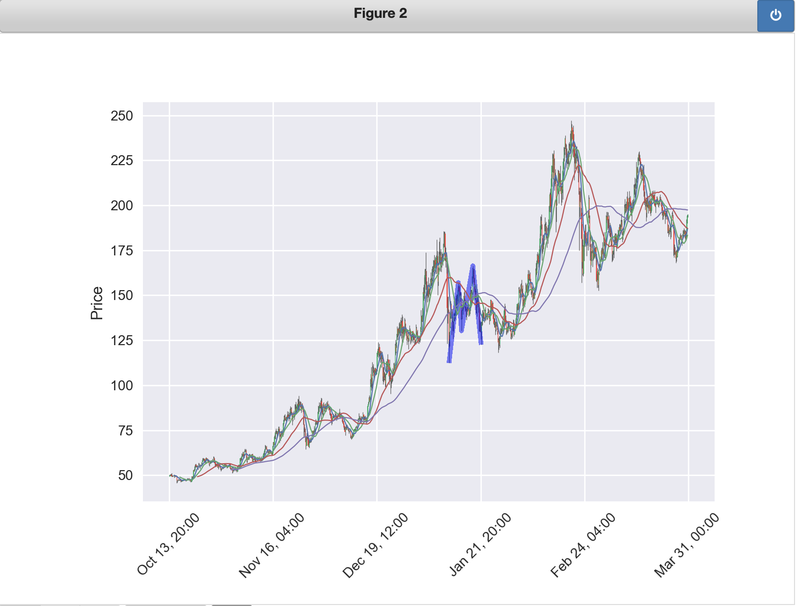

### Harmonic Pattern Detector

```
In short, this project filters ZIGZAG patterns that fit-in Harmonic Patterns.
```

##### support patterns 

[Harmonic Trading reference](https://harmonicpattern.com/blog/harmonic-pattern-and-elliot-wave-theory-advanced-technique/)

+ ABCD
+ Gartley
+ Bat
+ AltBat
+ ButterFly
+ Crab
+ DeepCrab
+ Shark
+ Cypper

+ all supports predict and deepsearch

##### patterns found



##### patterns predict


#### Reqirements

+ TA-Lib

<details>

  <summary> <b>Setup</b>   </summary>
  <p>
  
  
  ```bash
  cd <project_dir>
  pip install -r requirements.txt
  pip install -e . # or python setup.py install
  ```
  
  </p>
</details>


###  Features

####  Visualize

+ Draw Harmonic Patterns in the graph using mplfinance + ipympl

####  Notify

+ Send alerts to Wechat when Harmonic are newly found

####  Predict

+ Predict harmonic patterns according to current kline

#### Else:

+ go to examples/*.ipynb
+ [example](examples/HarmoCurrent.ipynb)
